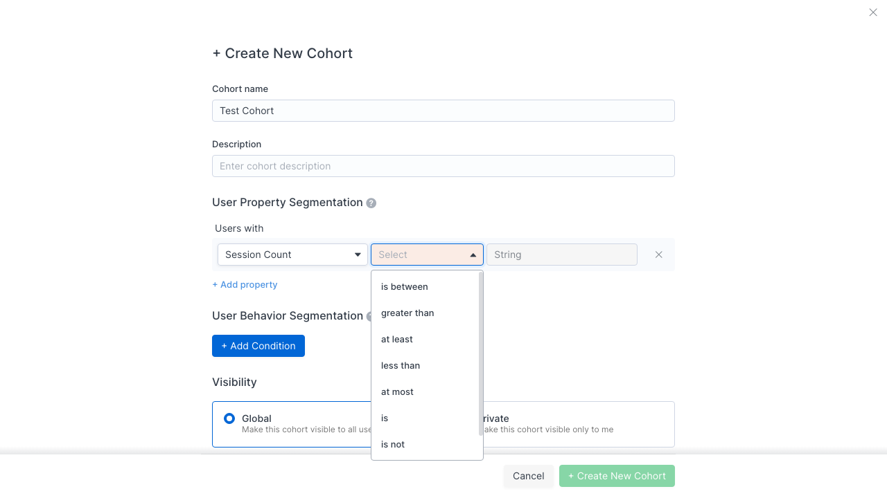
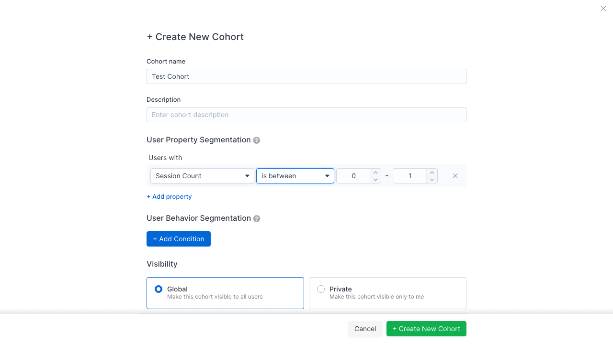

# Countly Cohort Drawer — Interaction Flows & State Transitions

## Drawer Lifecycle

### Opening
- **Trigger**: Click "+ New Cohort" button on cohorts page
- **Visual Change**: Full-width drawer slides in from the right, overlaying the main content
- **Layout**: Drawer contains a scrollable body with fixed header ("+ Create New Cohort") and fixed footer (Cancel / + Create New Cohort buttons)
- **Close button**: X icon in top-right corner of drawer

### Closing
- **Trigger**: Click X button or Cancel button
- **Visual Change**: Drawer slides out to the right

### Screenshot Reference


---

## Section 1: Cohort Name & Description

### Initial State
- **Cohort name**: Text input with placeholder "Enter cohort name"
- **Description**: Text input with placeholder "Enter cohort description"
- Both fields are full-width, standard text inputs with light gray borders

---

## Section 2: User Property Segmentation

### Initial State (Single Row)
- Label: "Users with"
- Three inline elements per row:
  1. **Property dropdown**: Placeholder "Select Property" (gray text), enabled
  2. **Operator dropdown**: Placeholder "Select" (gray text), **disabled**
  3. **Value input**: Placeholder "String" (gray text), **disabled**
- **X button**: Remove row (right-aligned)
- Below row: "+ Add property" link (blue text)

### Screenshot Reference


---

### Flow 2.1: Select Property Dropdown

#### Click "Select Property" -> Dropdown opens
- **Trigger**: Click on the "Select Property" text input
- **Visual Change**: Dropdown appears below the trigger, positioned as a body-level popper
- **Layout**:
  - Search input at top with magnifying glass icon, placeholder "Search in Properties", auto-focused with blue focus ring
  - Tab bar below search: **All Properties** | **User** | **Custom** | **Campaign** (right arrow scroll indicator) | **Push Notification**
  - "All Properties" tab active by default (underline indicator)
  - Scrollable list of property items below tabs
- **Properties visible (All Properties tab)**: ID, Age, App Version, Browser, Browser version, Birth year, Carrier, Days of retention, ...
- **State Dependencies**: Operator and Value dropdowns remain disabled while property is being selected

#### Screenshot Reference


#### Type in search -> List filters in real-time
- **Trigger**: Type text in "Search in Properties" input
- **Visual Change**: List filters to show only matching property names
- **Example**: Typing "Name" shows: "Last view name", "Name", "Username"
- **Behavior**: Filter applies across the active tab, no delay

#### Screenshot Reference


#### Click property item -> Dropdown closes, row updates
- **Trigger**: Click on a property item in the list (e.g., "Name")
- **Visual Change**:
  - Dropdown closes immediately (no animation)
  - Property name appears in the first select (e.g., "Name")
  - **Operator dropdown becomes ENABLED** (was disabled)
  - Value input remains disabled (depends on operator selection)
- **State Dependencies**: The operator options change based on the property type (string, numeric, date, boolean)

#### Screenshot Reference


---

### Flow 2.2: String Operator Dropdown (Property: Name)

#### Click operator dropdown -> Shows string operators
- **Trigger**: Click the "Select" operator dropdown (now enabled)
- **Visual Change**: Dropdown appears below the trigger showing operator options
- **String Operators Available**:
  1. **is**
  2. **is not**
  3. **contains**
  4. **doesn't contain**
  5. **is set**
  6. **begins with**
- **Layout**: Simple list dropdown, no search, no tabs

#### Screenshot Reference


#### Select "is" operator -> Value input becomes enabled
- **Trigger**: Click "is" in the operator dropdown
- **Visual Change**:
  - Operator dropdown closes, shows "is"
  - **Value input becomes ENABLED** with placeholder "String"
  - Value input is a free-text input field
- **Row reads**: Name | is | [String input]

#### Screenshot Reference


#### Select "is set" operator -> Value changes to Yes/No dropdown
- **Trigger**: Reopen operator dropdown, select "is set"
- **Visual Change**:
  - Operator shows "is set"
  - **Value field transforms from text input to a dropdown** with placeholder "Select"
  - The dropdown contains: "yes" and "no" options
  - Search input "Search in Values" at the top of the value dropdown
- **State Change**: The value field type is dynamically determined by the operator

#### Screenshot Reference


#### Click Yes/No value dropdown -> Shows yes/no options
- **Trigger**: Click the "Select" value dropdown
- **Visual Change**: Dropdown opens showing:
  - Search input: "Search in Values"
  - Option: "yes"
  - Option: "no"

#### Screenshot Reference


---

### Flow 2.3: Adding Multiple Property Rows

#### Click "+ Add property" -> Second row appears with AND/OR toggle
- **Prerequisite**: First row must have a value selected (orange validation border appears otherwise)
- **Trigger**: Click "+ Add property" link
- **Visual Change**:
  - AND/OR toggle appears between row 1 and row 2
  - AND is selected by default (blue/filled background)
  - OR is unselected (gray outline)
  - New row appears with: Select Property | Select (disabled) | String (disabled) | X
- **Layout**: Toggle is left-aligned, pill-style radio buttons

#### Screenshot Reference


#### Click "OR" toggle -> OR becomes active
- **Trigger**: Click "OR" radio button
- **Visual Change**:
  - OR becomes blue/filled
  - AND becomes gray/outline
  - No other visual changes to the rows

#### Screenshot Reference


---

### Flow 2.4: Numeric Property (Session Count)

#### Select "Session Count" on second row -> Numeric operators available
- **Trigger**: Click property dropdown on second row, search "Session", select "Session Count"
- **Visual Change**: "Session Count" appears in the property field, operator dropdown becomes enabled

#### Screenshot Reference


#### Search "Session" in property dropdown
- **Visual Change**: Filters to "Session Count" and "Total Session Duration"

#### Screenshot Reference


#### Click numeric operator dropdown -> Shows numeric operators
- **Trigger**: Click operator dropdown for Session Count
- **Numeric Operators Available**:
  1. **is between**
  2. **greater than**
  3. **at least**
  4. **less than**
  5. **at most**
  6. **is**
  7. **is not**
- **Layout**: Simple list dropdown, no search, no tabs

#### Screenshot Reference


#### Select "is between" -> Dual number spinners appear
- **Trigger**: Select "is between" from numeric operators
- **Visual Change**:
  - Value field transforms into **two number spinner inputs** separated by a dash "-"
  - First spinner default value: 0
  - Second spinner default value: 1
  - Each spinner has up/down arrow buttons
- **Row reads**: Session Count | is between | [0] - [1]

#### Screenshot Reference


#### Select "is" for numeric -> Single number input
- **Trigger**: Change operator to "is"
- **Visual Change**:
  - Value field transforms into **single text input** with placeholder "Number"
  - No spinner arrows (plain text input)
- **Row reads**: Session Count | is | [Number input]

#### Screenshot Reference


---

## Section 3: User Behavior Segmentation

### Initial State
- Section heading: "User Behavior Segmentation" with info tooltip icon
- Blue button: "+ Add Condition"
- No behavior rows visible initially

### Flow 3.1: Add Behavior Condition

#### Click "+ Add Condition" -> Behavior row appears
- **Trigger**: Click the blue "+ Add Condition" button
- **Visual Change**:
  - New behavior row appears under "Users who" label
  - Row contains 4 inline elements:
    1. **Behavior type**: "performed" (text button/dropdown trigger)
    2. **Event selector**: "Sessions" (default, text button)
    3. **Frequency trigger**: "at least 1 time" (dropdown trigger with caret)
    4. **Time range trigger**: "All time" (dropdown trigger with calendar icon and caret)
  - X button to remove the condition
  - Below the row: "which has" text and "+ Add property" link (for event property filtering)
  - Dashed separator line before the "+ Add Condition" button

#### Screenshot Reference


### Flow 3.2: Behavior Type Dropdown

#### Click "performed" -> Shows performed/didn't perform options
- **Trigger**: Click on "performed" text
- **Visual Change**: Small dropdown appears with two options:
  1. **performed** (highlighted in blue - currently selected)
  2. **didn't perform**
- **Layout**: Compact dropdown positioned below the trigger

#### Screenshot Reference


### Flow 3.3: Event Type Selector

#### Click event name (e.g., "Sessions") -> Event selector panel opens
- **Trigger**: Click on the event name text
- **Visual Change**: Large panel/dropdown opens with:
  - **Tab bar**: Sessions | Events | View | Feedback | LLM Observability | Consent | Crash | Push Actioned | Journey
  - "Sessions" tab active by default (blue highlight)
  - Tooltip showing internal event key (e.g., "[CLY]_session")
- **Layout**: Full-width panel overlaying the form, positioned below the trigger

#### Screenshot Reference


#### Click "Events" tab -> Shows custom events list
- **Trigger**: Click "Events" tab in the event selector
- **Visual Change**:
  - "Events" tab becomes active (blue)
  - Search input appears: "Search in Events"
  - List of custom events: Comment Added, Feature Used, File Uploaded, Integration Connected, Project Archived, Project Created, **Task Completed** (highlighted in green/teal - indicates it was used in another cohort), Task Created
- **Layout**: Scrollable list with search

#### Screenshot Reference


#### Select an event -> Event name appears in row
- **Trigger**: Click an event (e.g., "Task Completed")
- **Visual Change**:
  - Event selector panel closes
  - Event name appears in the row (truncated with "..." if too long, e.g., "Task Comple...")
  - Row still shows default frequency "at least 1 time" and time range "All time"

#### Screenshot Reference


### Flow 3.4: Frequency Trigger (Popover)

#### Click "at least 1 time" -> Frequency popover opens
- **Trigger**: Click "at least 1 time" dropdown trigger
- **Expected Visual Change** (based on Countly documentation):
  - Popover appears with radio button options:
    - at least [number] time(s)
    - at most [number] time(s)
    - exactly [number] time(s)
  - Number input spinner
  - Apply button
- **Note**: This is an el-popover component that was not successfully triggered via automation

### Flow 3.5: Time Range Trigger (Popover)

#### Click "All time" -> Time range popover opens
- **Trigger**: Click "All time" dropdown trigger
- **Expected Visual Change** (based on Countly documentation):
  - Popover with time range options:
    - In between (date picker)
    - Before (date picker)
    - Since (date picker)
    - In the last [number] [days/weeks/months]
    - All time (default)
  - Apply button
- **Note**: This is an el-popover component that was not successfully triggered via automation

### Flow 3.6: Event Property Filtering

#### "which has" + "+ Add property" link
- Below each behavior condition row, there's:
  - Text: "which has"
  - Link: "+ Add property" (blue text)
- **Purpose**: Allows filtering the event by its custom properties (e.g., "Task Completed where Country is Turkey")

---

## Section 4: Multiple Behavior Conditions

#### Click "+ Add Condition" again -> Second behavior condition with AND/OR
- **Trigger**: Click "+ Add Condition" button
- **Expected Visual Change**:
  - Dashed separator line between conditions
  - AND/OR toggle between behavior conditions (similar to property rows)
  - New behavior condition row with same structure

---

## Section 5: Visibility

### Layout
- Section heading: "Visibility"
- Two card-style radio options side by side:
  1. **Global** (left card):
     - Radio button + "Global" label (bold)
     - Description: "Make this cohort visible to all users"
     - **Default selection**: Yes (blue radio, blue border on card)
  2. **Private** (right card):
     - Radio button + "Private" label (bold)
     - Description: "Make this cohort visible only to me"
     - **Default selection**: No (gray radio, no highlight border)

### Click "Private" -> Private becomes selected
- **Trigger**: Click anywhere on the Private card
- **Visual Change**:
  - Private radio becomes filled (blue)
  - Private card gets blue/highlight border
  - Global radio becomes empty (gray)
  - Global card loses its blue border
- **No other form changes**

#### Screenshot Reference


---

## Section 6: Footer

### Layout
- Fixed at bottom of drawer
- Two buttons right-aligned:
  1. **Cancel**: Text button (no background), gray text
  2. **+ Create New Cohort**: Green/teal filled button, white text
- **Validation Warning**: When a cohort with identical segmentation already exists, a yellow warning banner appears above the footer: "You can't proceed because a cohort with the selected segmentations already exists [View it]"

#### Screenshot Reference


---

## Summary of State Transitions

### Property Row State Machine
```
Initial: [Select Property (enabled)] [Select (disabled)] [String (disabled)]
    |
    v  (Select a property)
Property Selected: [PropertyName] [Select (ENABLED)] [String/Number (disabled)]
    |
    v  (Select an operator)
Operator Selected: [PropertyName] [OperatorName] [Value Input (ENABLED)]
```

### Value Field Type by Operator
| Operator | Value Field Type |
|----------|-----------------|
| is | Text input (String) or Number input |
| is not | Text input (String) or Number input |
| contains | Text input |
| doesn't contain | Text input |
| is set | Yes/No dropdown |
| begins with | Text input |
| is between | Dual number spinners (min - max) |
| greater than | Number input |
| at least | Number input |
| less than | Number input |
| at most | Number input |

### Operator Types by Property Data Type
| Property Type | Available Operators |
|--------------|-------------------|
| **String** (e.g., Name) | is, is not, contains, doesn't contain, is set, begins with |
| **Numeric** (e.g., Session Count) | is between, greater than, at least, less than, at most, is, is not |

### Behavior Row State Machine
```
Initial: [+ Add Condition] button only
    |
    v  (Click + Add Condition)
Condition Added: [performed] [Sessions] [at least 1 time] [All time] [X]
                  "which has"
                  "+ Add property"
```

### Visibility State
```
Default: Global (selected/blue) | Private (unselected/gray)
Toggle:  Global (unselected/gray) | Private (selected/blue)
```

---

## Data Test ID Patterns

The following `data-test-id` patterns were discovered during testing:

### Property Selection
- Property dropdown items: `cohorts-drawer-property-select-property-dropdown-{rowIndex}-item-{propertyKey}`
  - Example: `cohorts-drawer-property-select-property-dropdown-0-item-name`

### Operator Selection
- Operator dropdown items: `cohorts-drawer-property-select-condition-dropdown-{rowIndex}-item-{operatorKey}-el-options`
  - Example: `cohorts-drawer-property-select-condition-dropdown-0-item-is-el-options`

### Behavior Segmentation
- Behavior type selector: `Select Behavior Type` (textbox)
- Event type tabs: `cohorts-drawer-seg-step-{stepIndex}-event-type-tab-{tabIndex}`
- Event type tab labels: `cohorts-drawer-seg-step-{stepIndex}-event-type-el-tab-{tabKey}`
  - Example: `cohorts-drawer-seg-step-0-event-type-el-tab-events`
- Event items: `cohorts-drawer-seg-step-{stepIndex}-event-type-item-{eventKey}`
  - Example: `cohorts-drawer-seg-step-0-event-type-item-sessions`
- Event pseudo-input label: `cohorts-drawer-seg-step-{stepIndex}-event-type-pseudo-input-label`

### Visibility
- Global radio: `Global Make this cohort visible to all users`
- Private radio: `Private Make this cohort visible only to me`

### Form Labels
- Cohort name header: `cohorts-drawer-cohorts-name-label-header`
- Cohort name input: `Enter cohort name` (placeholder)
- Description input: `Enter cohort description` (placeholder)

---

## Screenshot Index

| # | File | Description |
|---|------|-------------|
| 01 | `prd-assets/cohort-01-drawer-open.png` | Drawer initial state after clicking + New Cohort |
| 02 | `prd-assets/cohort-02-property-dropdown-open.png` | Property dropdown open with tabs and search |
| 03 | `prd-assets/cohort-03-property-search.png` | Property search filtered to "Name" |
| 04 | `prd-assets/cohort-04-name-selected.png` | Name property selected, operator enabled |
| 05 | `prd-assets/cohort-05-string-operators.png` | String operator dropdown open |
| 06 | `prd-assets/cohort-06-is-operator.png` | "is" operator selected, String value input enabled |
| 07 | `prd-assets/cohort-07-is-set.png` | "is set" operator selected, value changed to dropdown |
| 08 | `prd-assets/cohort-08-yes-no-dropdown.png` | Yes/No value dropdown open |
| 10 | `prd-assets/cohort-10-two-rows-and-or.png` | Two property rows with AND/OR toggle |
| 10b | `prd-assets/cohort-10b-or-selected.png` | OR toggle selected (blue) |
| 11 | `prd-assets/cohort-11-session-count.png` | Session Count numeric property selected |
| 11b | `prd-assets/cohort-11b-session-search.png` | Session search results in property dropdown |
| 12 | `prd-assets/cohort-12-numeric-operators.png` | Numeric operator dropdown open |
| 13 | `prd-assets/cohort-13-is-between.png` | "is between" with dual number spinners |
| 14 | `prd-assets/cohort-14-numeric-is.png` | Numeric "is" with single Number input |
| 15 | `prd-assets/cohort-15-behavior-added.png` | Behavior condition row added |
| 16 | `prd-assets/cohort-16-behavior-type-select.png` | Behavior type dropdown (performed/didn't perform) |
| 17 | `prd-assets/cohort-17-event-tabs.png` | Event type selector with tabs |
| 17b | `prd-assets/cohort-17b-events-tab.png` | Events tab with custom events list |
| 18 | `prd-assets/cohort-18-event-selected.png` | Task Completed event selected |
| 23 | `prd-assets/cohort-23-private-selected.png` | Private visibility selected |
| 24 | `prd-assets/cohort-24-footer.png` | Footer and full scrolled view |
