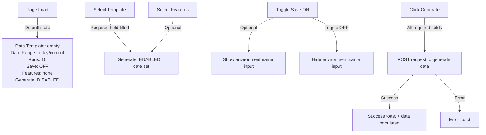

# Countly Data Populator Plugin - Product Requirements Document

**Version:** 1.0
**Date:** February 27, 2026
**Status:** Design Specification
**Component ID:** cly-cmp-7458

---

## 1. Overview

The **Data Populator** plugin is a Countly dashboard feature that enables users to generate realistic demo data for their applications. It provides template-based data generation with customizable date ranges, run frequencies, and feature inclusions.

**Primary Route:** `routename-populate`
**Container Class:** `populator-wrapper cly-cmp-7458`

---

## 2. Functional Requirements

### 2.1 Primary Navigation Tabs

Two top-level tabs with button styling (`el-tabs--button`):

| Tab Name | Route/State | Active Default |
|----------|-------------|-----------------|
| **Data Populator** | Active view | Yes |
| **Templates** | Template management view | No |

**Implementation:** `el-tabs el-tabs--top el-tabs--button` with `el-tabs__item is-top`

---

### 2.2 Secondary Navigation Tabs

Two secondary tabs within Data Populator view (`cly-vue-tabs__secondary-tab-list`):

| Tab | Test ID | Active Default | Function |
|-----|---------|-----------------|----------|
| **Populate with Template** | `tab-populate-with-template-title` | Yes | Use predefined templates to generate data |
| **Populate with Environment** | `tab-populate-with-environment-title` | No | Use saved environments to populate data |

---

### 2.3 Form Fields (Populate with Template Tab)

All form fields use layout class `cly-vue-section__sub bu-px-4 bu-py-2 bu-columns bu-is-vcentered`:
- **Label Column:** `bu-column bu-is-2 populator-input-area` (fixed width)
- **Input Column:** `bu-column main-page-container` (flexible width)

#### 2.3.1 Data Template Dropdown

**Label:** "Data template" [STATIC/i18n]
**Test ID:** `data-populator-template-select`
**Type:** `cly-vue-select-x` (searchable dropdown)
**Placeholder:** "Select a template" [STATIC/i18n]
**Tooltip:** `populate-with-template-data-template-tooltip` [STATIC/i18n]

**Options (6 templates)** [STATIC/i18n]:
- Social
- B2B SaaS
- Healthcare
- Finance
- Entertainment
- E-commerce

**State Rules:**
- Selection is **required** to enable Generate button
- Default: unselected

---

#### 2.3.2 Date Range Picker

**Label:** "Date range" [STATIC/i18n]
**Type:** `cly-vue-daterp` (date range picker)
**Pseudo Display:** "Jan 29, 2026 - Feb 27, 2026" [DYNAMIC/SYSTEM]
**Test ID:** `cly-dropdown-default-test-id-dropdown-el-select`

**Preset Options** [STATIC/i18n]:
- Custom range
- Yesterday
- Today
- Last 7 days
- Last 30 days
- Last 60 days
- January, 2026
- February, 2026
- 2026

**State Rules:**
- Default: Today or current month
- Allows custom date range selection via date picker modal

---

#### 2.3.3 Number of Runs Selector

**Label:** "Number of runs" [STATIC/i18n]
**Type:** Custom radio-button component (`populator-number-selector`)
**Tooltip:** `populate-with-template-number-of-runs-tooltip` [STATIC/i18n]

**Options (3 choices)** [STATIC/FIXED]:
- **10** (default/active) - Classes: `populator-number-selector__each populator-number-selector__active populator-number-selector__first`
- **50** - Classes: `populator-number-selector__each`
- **100** - Classes: `populator-number-selector__each populator-number-selector__last`

**CSS Behavior:**
- Active option has class `populator-number-selector__active`
- First button has `populator-number-selector__first` (left border-radius)
- Last button has `populator-number-selector__last` (right border-radius)
- Each option is flexbox child of `populator-number-selector` with `bu-is-flex`

---

#### 2.3.4 Save Environment Toggle & Input

**Toggle Label:** "Save environment" [STATIC/i18n]
**Tooltip:** `populate-with-template-save-environment-tooltip` [STATIC/i18n]
**Toggle Type:** `el-switch` (checkbox input)
**Test ID (Toggle):** `save-environment-el-switch-input`

**Text Input (Conditional):**
- **Label:** (inline with toggle)
- **Test ID:** `populate-with-template-save-environment-input`
- **Placeholder:** "Enter an environment name" [STATIC/i18n]
- **Type:** text
- **Container Class:** `populator-wrapper__save-field el-input`
- **Visibility:** Shown only when toggle is **ON**

**State Rules:**
- Toggle OFF (default): input field is hidden/disabled
- Toggle ON: input field is enabled for user input
- Environment name is optional when saving

---

#### 2.3.5 Include Features Multi-Select

**Label:** "Include Features" [STATIC/i18n]
**Tooltip:** `populate-with-template-include-features-tooltip` [STATIC/i18n]
**Type:** `cly-vue-select-x` with `el-checkbox-group`
**Test ID:** `populate-with-template-features-select`
**Placeholder:** "Select features" [STATIC/i18n]

**Feature Options** [DYNAMIC/DB]:
- **A/B Testing** (test ID: `populate-with-template-features-select-checklistbox-a/b-testing-el-checkbox-label`)
- **Cohorts** (test ID: `populate-with-template-features-select-checklistbox-cohorts-el-checkbox-label`)

**Future Extensions:** Additional features may be added to this list via plugin configuration.

**State Rules:**
- Multiple selection enabled (checkboxes)
- All features optional
- Selected features are included in generated demo data

---

#### 2.3.6 Generate Demo Data Button

**Label:** "Generate Demo Data" [STATIC/i18n]
**Type:** `el-button el-button--success el-button--medium`
**Test ID:** `generate-button`
**Default State:** `is-disabled` (disabled)
**Button Color:** Green (success styling)

**Enable Conditions:**
- At least one data template selected (required field)
- Date range selected or defaulted (required field)
- Number of runs selected (always has default: 10)

**Interaction:**
- Click triggers data generation process
- Should show loading state during generation
- Success/error feedback expected after completion

---

## 3. Design System & Visual Hierarchy

### 3.1 Component Library Stack

| Layer | Framework | Version | Purpose |
|-------|-----------|---------|---------|
| **UI Framework** | Element UI | v2.x | Core form components (select, switch, button, tabs) |
| **Layout System** | Bulma CSS | Latest | Flexible grid and spacing utilities |
| **Custom Wrapper** | Countly Vue Components | Proprietary | `cly-vue-*` custom components wrapping Element UI |

### 3.2 Layout Architecture

**Main Container:**
```
div.routename-populate
  └── div.populator-wrapper.cly-cmp-7458
      ├── div.cly-vue-tabs (Primary nav: Data Populator / Templates)
      └── div.cly-vue-main
          ├── div.cly-vue-tabs (Secondary nav: Populate with Template / Environment)
          └── div.cly-vue-section.populator-wrapper__main-page-form
              └── div.cly-vue-section__content.white-bg
                  ├── Form field rows (cly-vue-section__sub)
                  └── Generate button row
```

### 3.3 Form Row Layout (Bulma Grid)

Each form field uses two-column layout:

```
div.cly-vue-section__sub.bu-px-4.bu-py-2.bu-columns.bu-is-vcentered
  ├── div.bu-column.bu-is-2.populator-input-area
  │   └── Label + optional tooltip/toggle
  └── div.bu-column.main-page-container
      └── Input component (select, input, radio, etc.)
```

**Spacing:**
- Horizontal padding: `bu-px-4` (1.5rem)
- Vertical padding: `bu-py-2` (0.5rem)
- Vertical alignment: `bu-is-vcentered` (flexbox center)

### 3.4 Custom Component Styles

#### Number Selector Component
```css
.populator-number-selector
  /* flexbox container */
  .populator-number-selector__each
    /* individual option button */
  .populator-number-selector__active
    /* highlight selected option */
  .populator-number-selector__first
    /* left border-radius */
  .populator-number-selector__last
    /* right border-radius */
```

#### Save Environment Input
```css
.populator-wrapper__save-field
  /* custom text input styling */
```

### 3.5 Color & State

- **Background:** `white-bg` (form container)
- **Header:** `white-bg` (Data Populator header)
- **Button (Active):** `el-button--success` (green, clickable state)
- **Button (Disabled):** `is-disabled` (grayed out, not clickable)

---

## 4. Interaction & State Management

### 4.1 Tab Switching Logic

**Primary Tabs:**
- Switching to "Templates" tab loads template management interface (not defined in this PRD)

**Secondary Tabs:**
- **Populate with Template** (active): Shows form defined in Section 2.3
- **Populate with Environment** (inactive): Shows alternative form using saved environment configurations (not defined in this PRD)

### 4.2 Form Field Dependencies



### 4.3 Form Validation Rules

| Field | Required | Validation | Error Handling |
|-------|----------|-----------|-----------------|
| Data Template | ✅ Yes | Must select one of 6 options | Generate button disabled |
| Date Range | ✅ Yes | Must be valid range | Auto-default to today |
| Number of Runs | ⚠️ Default | Always has value (10, 50, or 100) | Validated server-side |
| Save Environment | ❌ No | Boolean toggle | N/A |
| Environment Name | ❌ No* | Text input | *Required only if Save toggle is ON |
| Include Features | ❌ No | Zero or more selections | N/A |

### 4.4 Button State Machine

```
DISABLED (initial)
  ↓
  [Data Template selected]
  ↓
ENABLED (all required fields valid)
  ↓
  [User clicks Generate]
  ↓
LOADING (button shows spinner, disabled)
  ↓
  [API responds]
  ↓
SUCCESS / ERROR (toast shown, button returns to ENABLED)
```

---

## 5. HTML Structure Reference

### 5.1 Root & Container

```html
<div class="routename-populate">
  <div>
    <div>
      <div class="populator-wrapper cly-cmp-7458">
        <!-- Tabs & content here -->
      </div>
    </div>
  </div>
</div>
```

### 5.2 Primary Tabs

```html
<div class="cly-vue-tabs">
  <div class="el-tabs el-tabs--top el-tabs--button">
    <div class="el-tabs__header is-top">
      <div class="el-tabs__nav is-top">
        <div class="el-tabs__item is-top is-active">Data Populator</div>
        <div class="el-tabs__item is-top">Templates</div>
      </div>
    </div>
    <div class="el-tabs__content">
      <div class="el-tab-pane">
        <!-- Content here -->
      </div>
    </div>
  </div>
</div>
```

### 5.3 Secondary Tabs

```html
<div class="cly-vue-tabs">
  <div class="cly-vue-tabs__secondary-tab-list">
    <div class="cly-vue-tabs__tab cly-vue-tabs__tab--secondary cly-vue-tabs__tab--secondary-active">
      <span data-test-id="tab-populate-with-template-title">Populate with Template</span>
    </div>
    <div class="cly-vue-tabs__tab cly-vue-tabs__tab--secondary">
      <span data-test-id="tab-populate-with-environment-title">Populate with Environment</span>
    </div>
  </div>
</div>
```

### 5.4 Data Template Dropdown

```html
<div class="cly-vue-section__sub bu-px-4 bu-py-2 bu-columns bu-is-vcentered">
  <div class="bu-column bu-is-2 populator-input-area">
    <span data-test-id="populate-with-template-data-template-label">Data template</span>
    <i data-test-id="populate-with-template-data-template-tooltip"></i>
  </div>
  <div class="bu-column main-page-container">
    <div class="cly-vue-dropdown el-select cly-vue-select-x main-page-inputs"
         data-test-id="data-populator-template-select-dropdown-el-select"
         placeholder="Select a template">
      <input data-test-id="data-populator-template-select" type="text" placeholder="Select a template">
      <div class="cly-vue-listbox">
        <div data-test-id="data-populator-template-select-item-social">Social</div>
        <div data-test-id="data-populator-template-select-item-b2b-saas">B2B SaaS</div>
        <div data-test-id="data-populator-template-select-item-healthcare">Healthcare</div>
        <div data-test-id="data-populator-template-select-item-finance">Finance</div>
        <div data-test-id="data-populator-template-select-item-entertainment">Entertainment</div>
        <div data-test-id="data-populator-template-select-item-e-commerce">E-commerce</div>
      </div>
    </div>
  </div>
</div>
```

### 5.5 Date Range Picker

```html
<div class="cly-vue-section__sub bu-px-4 bu-py-2 bu-columns bu-is-vcentered">
  <div class="bu-column bu-is-2 populator-input-area">
    <span data-test-id="populate-with-template-data-range-label">Date range</span>
  </div>
  <div class="bu-column main-page-container">
    <div class="cly-vue-dropdown el-select populator-wrapper__date-picker main-page-inputs"
         data-test-id="cly-dropdown-default-test-id-dropdown-el-select">
      <span data-test-id="populate-with-template-date-range-pseudo-input-label">Jan 29, 2026 - Feb 27, 2026</span>
      <div class="cly-vue-daterp">
        <span data-test-id="populate-with-template-date-range-select-date-custom-label">Custom range</span>
        <span data-test-id="populate-with-template-date-range-select-date-yesterday-button">Yesterday</span>
        <span data-test-id="populate-with-template-date-range-select-date-today-button">Today</span>
        <span data-test-id="populate-with-template-date-range-select-date-last-7-days-button">Last 7 days</span>
        <span data-test-id="populate-with-template-date-range-select-date-last-30-days-button">Last 30 days</span>
        <span data-test-id="populate-with-template-date-range-select-date-last-60-days-button">Last 60 days</span>
        <span data-test-id="populate-with-template-date-range-select-date-january-2026-button">January, 2026</span>
        <span data-test-id="populate-with-template-date-range-select-date-february-2026-button">February, 2026</span>
        <span data-test-id="populate-with-template-date-range-select-date-2026-button">2026</span>
      </div>
    </div>
  </div>
</div>
```

### 5.6 Number of Runs Selector

```html
<div class="cly-vue-section__sub bu-px-4 bu-py-2 bu-columns bu-is-vcentered">
  <div class="bu-column bu-is-2 populator-input-area">
    <span data-test-id="populate-with-template-number-of-runs-label">Number of runs</span>
    <i data-test-id="populate-with-template-number-of-runs-tooltip"></i>
  </div>
  <div class="bu-column main-page-container">
    <div class="bu-is-flex populator-number-selector">
      <div class="populator-number-selector__each populator-number-selector__active populator-number-selector__first">
        <span data-test-id="populate-with-template-select-number-of-runs-item-10">10</span>
      </div>
      <div class="populator-number-selector__each">
        <span data-test-id="populate-with-template-select-number-of-runs-item-50">50</span>
      </div>
      <div class="populator-number-selector__each populator-number-selector__last">
        <span data-test-id="populate-with-template-select-number-of-runs-item-100">100</span>
      </div>
    </div>
  </div>
</div>
```

### 5.7 Save Environment Toggle & Input

```html
<div class="cly-vue-section__sub bu-px-4 bu-py-2 bu-columns bu-is-vcentered">
  <div class="bu-column bu-is-2 populator-input-area">
    <div class="el-switch" data-test-id="save-environment-el-switch-wrapper">
      <input data-test-id="save-environment-el-switch-input" type="checkbox">
      <span data-test-id="save-environment-el-switch-core"></span>
    </div>
    <span data-test-id="populate-with-template-save-environment-label">Save environment</span>
    <i data-test-id="populate-with-template-save-environment-tooltip"></i>
  </div>
  <div class="bu-column main-page-container">
    <div class="populator-wrapper__save-field el-input">
      <input data-test-id="populate-with-template-save-environment-input" type="text" placeholder="Enter an environment name">
    </div>
  </div>
</div>
```

### 5.8 Include Features Multi-Select

```html
<div class="cly-vue-section__sub bu-px-4 bu-py-2 bu-columns bu-is-vcentered">
  <div class="bu-column bu-is-2 populator-input-area">
    <span data-test-id="populate-with-template-include-features-label">Include Features</span>
    <i data-test-id="populate-with-template-include-features-tooltip"></i>
  </div>
  <div class="bu-column main-page-container">
    <div class="cly-vue-dropdown el-select cly-vue-select-x main-page-inputs"
         data-test-id="populate-with-template-features-select-dropdown-el-select"
         placeholder="Select features">
      <input data-test-id="populate-with-template-features-select" type="text" placeholder="Select features">
      <div class="el-checkbox-group">
        <label data-test-id="populate-with-template-features-select-checklistbox-a/b-testing-el-checkbox-label">A/B Testing</label>
        <label data-test-id="populate-with-template-features-select-checklistbox-cohorts-el-checkbox-label">Cohorts</label>
      </div>
    </div>
  </div>
</div>
```

### 5.9 Generate Button

```html
<div class="cly-vue-section__sub bu-px-4 bu-py-4">
  <button class="el-button el-button--success el-button--medium is-disabled"
          data-test-id="generate-button">Generate Demo Data</button>
</div>
```

---

## 6. Localization & i18n Strategy

### 6.1 Static UI Labels [STATIC/i18n]

All user-facing text is internationalized via Countly's translation system:

- "Data template"
- "Date range"
- "Number of runs"
- "Save environment"
- "Include Features"
- "Generate Demo Data"
- "Select a template"
- "Select features"
- "Enter an environment name"
- "Populate with Template"
- "Populate with Environment"
- "Custom range", "Yesterday", "Today", "Last 7 days", "Last 30 days", "Last 60 days", "January, 2026", "February, 2026", "2026"

### 6.2 Static Template Names [STATIC/i18n]

Template options are localized:
- Social
- B2B SaaS
- Healthcare
- Finance
- Entertainment
- E-commerce

### 6.3 Dynamic Feature Names [DYNAMIC/DB]

Feature list (A/B Testing, Cohorts) is loaded from plugin configuration or database and may be updated independently of UI code.

### 6.4 Dynamic Date Values [DYNAMIC/SYSTEM]

Date range display ("Jan 29, 2026 - Feb 27, 2026") is calculated dynamically based on:
- Selected date range
- User's locale and timezone
- System date at runtime

---

## 7. Accessibility & Semantic HTML

### 7.1 Form Structure

- Form fields use proper `<label>` elements (el-checkbox-group labels for checkboxes)
- All inputs have associated `data-test-id` attributes for testing
- Buttons have clear, descriptive labels
- Tooltips provide additional context (marked with `has-tooltip` class)

### 7.2 ARIA & Semantic Roles

- Toggle switch: `el-switch` component (implements ARIA role for checkbox)
- Dropdown selects: `cly-vue-select-x` with `el-select` (implements combobox role)
- Tabs: `el-tabs` with proper tab/tabpanel roles
- Multi-select: `el-checkbox-group` with individual checkbox labels

### 7.3 Keyboard Navigation

- All form fields should be keyboard accessible
- Tab order: Template → Date Range → Runs → Save toggle → Features → Generate button
- Number selector buttons should be keyboard navigable (arrow keys or Tab)
- Dropdowns should open/close with Enter and Space

---

## 8. API Integration & Backend Requirements

### 8.1 Generate Data Endpoint

**Request:**
```json
{
  "template": "Social|B2B SaaS|Healthcare|Finance|Entertainment|E-commerce",
  "dateRange": {
    "start": "YYYY-MM-DD",
    "end": "YYYY-MM-DD"
  },
  "numberOfRuns": 10|50|100,
  "saveEnvironment": {
    "enabled": true|false,
    "name": "string (optional if enabled=true)"
  },
  "features": ["A/B Testing", "Cohorts"] // optional array
}
```

**Response:**
```json
{
  "success": true|false,
  "message": "string",
  "dataId": "string (if successful)",
  "recordsGenerated": 12500,
  "environmentId": "string (if saveEnvironment.enabled=true)"
}
```

### 8.2 Error Handling

- Validation errors: Display inline form errors
- Server errors: Toast notification with error message
- Network errors: Retry logic with exponential backoff

---

## 9. Data Model & Storage

### 9.1 Saved Environment Schema

When "Save environment" is enabled, store:
```json
{
  "id": "uuid",
  "name": "string",
  "template": "string",
  "dateRange": { "start": "YYYY-MM-DD", "end": "YYYY-MM-DD" },
  "numberOfRuns": 10|50|100,
  "features": ["string"],
  "createdAt": "ISO8601",
  "updatedAt": "ISO8601",
  "createdBy": "userId"
}
```

### 9.2 Generated Data Tracking

Track:
- Number of records generated per run
- Timestamp of generation
- Template used
- User who triggered generation
- Associated environment (if saved)

---

## 10. Future Enhancements

### 10.1 Roadmap Items

1. **Populate with Environment Tab:** Switch to pre-saved environment configurations for data generation
2. **Templates Management:** Create, edit, delete custom templates (second primary tab)
3. **Advanced Filtering:** Filter generated data by event type, user segment, etc.
4. **Batch Scheduling:** Schedule recurring data generation
5. **Data Visualization:** Preview generated data before committing
6. **Custom Feature Packs:** User-defined feature combinations beyond A/B Testing & Cohorts

### 10.2 Configuration & Customization

- Plugin config should allow adding/removing templates
- Feature list is dynamic and loaded from plugin configuration
- Date range presets could be customized per instance

---

## 11. Testing & Validation

### 11.1 Unit Tests

- Template selection enables/disables Generate button
- Date range picker opens and selects dates correctly
- Number selector maintains mutually exclusive active state
- Save environment toggle shows/hides input field
- Feature checkboxes can be selected/deselected
- Form submits with correct payload structure

### 11.2 Integration Tests

- Generate button successfully calls backend API
- Generated data appears in Countly dashboard after generation
- Saved environments are retrievable in "Populate with Environment" tab
- Error responses show appropriate user messages

### 11.3 E2E Tests (using data-test-id attributes)

- Full workflow: Select template → Set date range → Choose runs → Generate → Verify success
- Alternative workflow: Select template → Save environment → Generate → Verify in environment list

---

## Appendix A: CSS Classes Reference

| Class | Purpose |
|-------|---------|
| `routename-populate` | Root container/route marker |
| `populator-wrapper` | Main plugin wrapper |
| `cly-cmp-7458` | Component ID for tracking |
| `cly-vue-tabs` | Tab container wrapper |
| `el-tabs` | Element UI tab styles |
| `cly-vue-select-x` | Custom select dropdown |
| `el-select` | Element UI select |
| `populator-number-selector` | Custom radio-button group |
| `populator-wrapper__date-picker` | Date picker styling |
| `populator-wrapper__save-field` | Save environment input |
| `populator-wrapper__main-page-form` | Main form container |
| `cly-vue-section` | Section wrapper |
| `cly-vue-section__sub` | Form row |
| `bu-column` | Bulma column |
| `bu-is-2` | Bulma 1/6 width (label column) |
| `bu-is-flex` | Bulma flexbox |
| `bu-is-vcentered` | Bulma vertical center |
| `bu-px-4` | Bulma horizontal padding |
| `bu-py-2` | Bulma vertical padding |
| `white-bg` | White background |
| `is-disabled` | Disabled button state |
| `is-active` | Active tab/option state |

---

**End of PRD**
